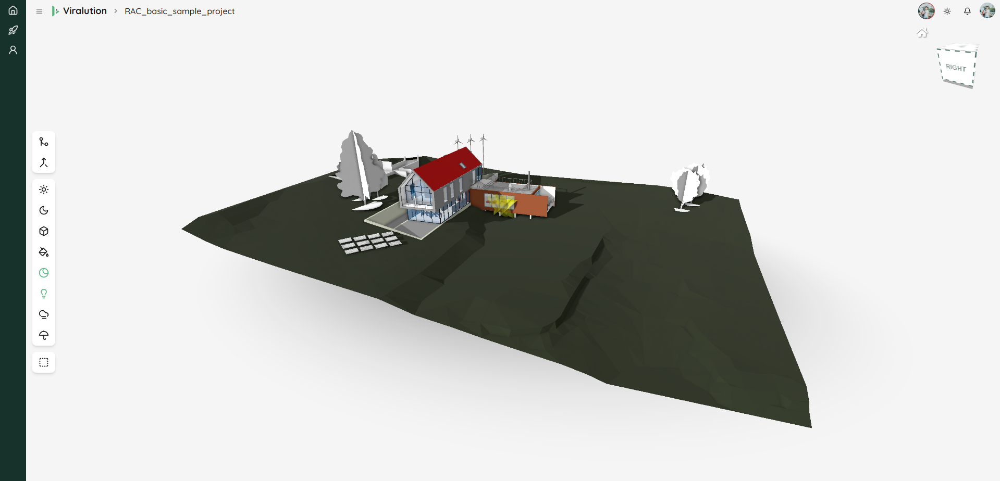

# ThePlatform - Self-hosted Viralution

<p align="center">
  
</p>

## Overview

ThePlatform is the self-hosted version of [Viralution](https://viralution.io/), allowing you to run the complete Viralution platform on your own infrastructure. This repository contains the necessary configuration and setup scripts to deploy Viralution in your environment.

## Features

- Complete self-hosted Viralution platform
- Local storage using MinIO S3-compatible object storage
- MongoDB for data persistence
- RabbitMQ for message queuing
- Containerized deployment with Docker

## Documentation

For detailed documentation on how to use the Viralution platform, please visit our [official documentation site](https://doc.viralution.io/).

## Prerequisites

- Docker and Docker Compose
- 4GB RAM minimum (8GB recommended)
- 10GB free disk space minimum
- Port 80, 9000, 9001, and others as specified in the docker-compose.yml file

## Quick Start for Development

Follow these steps to start the platform in development mode:

1. Clone this repository:
   ```bash
   git clone https://github.com/yourusername/ThePlatform.git
   cd ThePlatform
   ```

2. Start the development environment:
   ```bash
   cd dev
   docker-compose up -d
   ```

3. The platform should now be accessible at:
   - Main application: http://localhost
   - MinIO Console: http://localhost:9001

4. To stop the development environment:
   ```bash
   docker-compose down
   ```

> **Note:** Production deployment instructions will be available in a future release. Currently, only development mode is supported.

## ⚠️ Important Disclaimers

### Development Mode Only

The configuration in this repository is intended for **local development environments only**. Do not use these settings in production without implementing proper security measures.

A production-ready configuration with enhanced security, scalability options, and deployment guides is planned for a future release. Stay tuned for updates!

### MinIO Storage Warning

This deployment uses MinIO for local object storage. In development mode:
- Data persistence depends on the volume mounts in docker-compose.yml
- Default MinIO credentials may be used (see viralution-minio.env)
- For production use, you should configure proper authentication and backup strategies

## Environment Configuration

Environment variables for each service are stored in the `dev/env/` directory:
- `viralution_api.env`: API service configuration
- `viralution_admin.env`: Admin interface configuration
- `viralution_client.env`: Client application configuration
- `viralution-minio.env`: MinIO object storage configuration
- `redis.env`: Redis configuration
- `rabbitmq.env`: RabbitMQ configuration

## Support

For issues, questions, or contributions, please:
- Read the [official documentation](https://doc.viralution.io/) for detailed guides and tutorials
- Open an issue in this repository
- Visit [Viralution Support](https://viralution.io/support) for professional support options

## License

This project is licensed under the MIT License with Viralution Branding Clause - see the [LICENSE](LICENSE) file for details. This license allows for any use while requiring preservation of the Viralution name and logo. 
